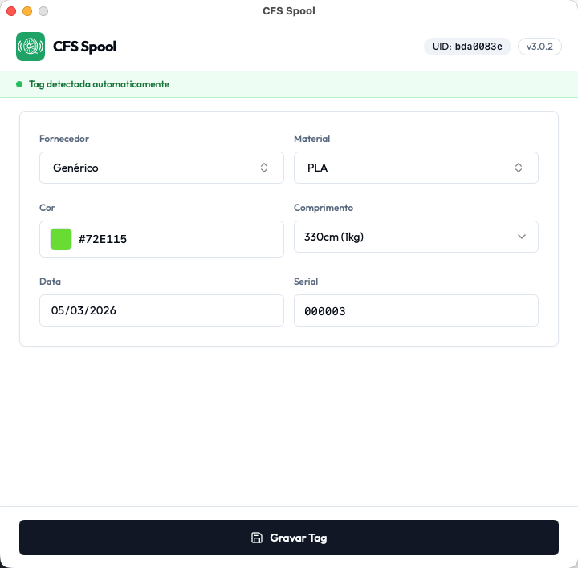
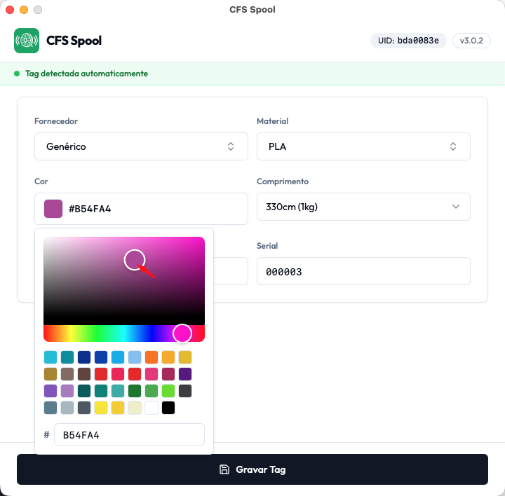
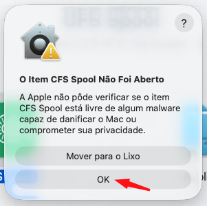
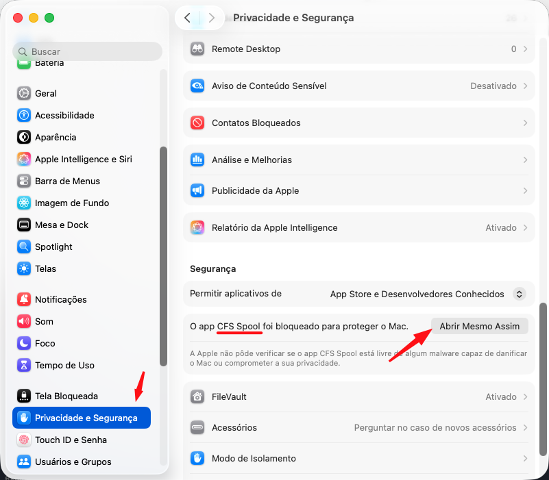

# CFS Spool - Gerenciador RFID de Filamentos Creality

Aplicativo desktop nativo (Wails v2 + React + shadcn/ui) para leitura e gravação de tags RFID do Creality File System (CFS) utilizadas em bobinas de filamento para impressoras 3D Creality.

[](README.md)
[](README.en.md)

## Funcionalidades

- **Aplicativo desktop nativo** -- sem necessidade de navegador ou servidor, executa diretamente no seu sistema operacional
- **Seletor avançado de cores**: 35 cores predefinidas baseadas no sistema Creality + seletor de cores para qualquer cor hexadecimal personalizada
- **Lógica inteligente**: Auto-seleção de fornecedor baseado no material escolhido
- **Preenchimento automático**: Campos opcionais (Lote, Serial) com padding automático
- **Leitura visual**: Preview das cores lidas das tags existentes
- **Criptografia/descriptografia AES-ECB**: Suporte completo ao sistema de criptografia Creality
- **Autenticação robusta**: Múltiplos métodos de fallback para leitura RFID
- **Derivação de chaves**: Algoritmo completo baseado no UID da tag
- **Compatibilidade**: Funciona com tags novas (FFFFFFFFFFFF) e usadas (chave derivada)

## Capturas de Tela

### Aplicativo

| | |
|:---:|:---:|
|  |  |
| *Tela principal* | *Seletor de cores* |

## Instalação

### Downloads Prontos (Recomendado)

Baixe a versão mais recente para sua plataforma:

**[Releases - GitHub](https://github.com/robertocorreajr/cfs_spool/releases/latest)**

| Plataforma | Arquivo | Formato |
|:---:|:---:|:---:|
| macOS (Apple Silicon) | `cfs-spool-darwin-arm64.dmg` | DMG (arraste para Applications) |
| Linux (x86_64) | `cfs-spool-linux-amd64.zip` | ZIP (extraia e execute) |
| Windows (x86_64) | `cfs-spool-windows-amd64.zip` | ZIP (extraia e execute) |

### macOS: Permitir execução (Gatekeeper)

O aplicativo não é assinado com certificado Apple Developer, então o macOS bloqueia a primeira execução. Use um dos métodos abaixo para liberar:

#### Método 1: Ajustes do Sistema (recomendado)

1. Abra o DMG e arraste o **CFS Spool** para a pasta **Applications**
2. Tente abrir o app normalmente (duplo clique) — ele será bloqueado
3. **Importante**: No diálogo de bloqueio, clique em **"OK"**. **Não clique em "Mover para o Lixo"**, pois isso apagará o app e você precisará arrastar novamente do DMG
4. Abra **Ajustes do Sistema** → **Privacidade e Segurança**
5. Na seção "Segurança", você verá a mensagem sobre o CFS Spool
6. Clique em **"Abrir Mesmo Assim"**
7. Confirme na próxima janela




#### Método 2: Terminal

Execute o comando abaixo no Terminal para remover a quarentena:

```bash
xattr -cr /Applications/CFS\ Spool.app
```

Depois, abra o app normalmente pelo Launchpad ou pasta Applications.

### Compilação a partir do Código Fonte

#### Pré-requisitos

- **Go 1.24+**
- **Node.js 18+**
- **Wails CLI**: `go install github.com/wailsapp/wails/v2/cmd/wails@latest`
- **Leitor RFID compatível** (testado com ACR122U)
- **Headers PC/SC**:
  - macOS: incluso no sistema (nenhuma ação necessária)
  - Linux: `sudo apt install pcscd libpcsclite-dev libgtk-3-dev libwebkit2gtk-4.1-dev`
  - Windows: incluso no sistema (winscard)

#### Comandos de Build

```bash
git clone https://github.com/robertocorreajr/cfs_spool.git
cd cfs_spool

# Modo de desenvolvimento (hot-reload)
wails dev

# Build de produção
wails build

# Compilar para todas as plataformas
make build-all
```

O binário de produção é gerado em `build/bin/`.

## Uso

1. Conecte seu leitor RFID ACR122U
2. Inicie o aplicativo (duplo clique ou execute pelo terminal)
3. **Ler Tag**: Coloque a tag no leitor e clique em "Ler Tag"
4. **Gravar Tag**: Preencha os campos e clique em "Gravar Tag"

### Seleção de Cores

Você tem total flexibilidade para escolher cores:
- Clique em uma das **35 cores predefinidas** da paleta
- Digite qualquer **código hexadecimal de 6 dígitos** manualmente no campo de texto
- Clique no **quadrado do seletor de cores** para abrir o espectro completo de cores

### Preenchimento Automático Inteligente

- Lote vazio automaticamente vira `000`
- Serial vazio automaticamente vira `000001`
- Padding automático com zeros à esquerda

### Lógica Inteligente

- Material Generic seleciona fornecedor Generic automaticamente
- Material Creality seleciona fornecedor 0276 (Creality) automaticamente
- Lista de materiais é filtrada pelo fornecedor selecionado

## Hardware Suportado

### Hardware Recomendado (Links de Afiliados)

#### AliExpress (Internacional)
- **[Leitor RFID ACR122U](https://s.click.aliexpress.com/e/_ok8qAl9)** -- Leitor usado no desenvolvimento (compatibilidade garantida)
- **[Etiquetas MIFARE Classic 1K](https://s.click.aliexpress.com/e/_oBPVnEb)** -- Tags compatíveis testadas no projeto

#### Mercado Livre (Brasil)
- **[Leitor e Gravador RFID](https://meli.la/13HiRy2)** -- Opção nacional para compra do leitor RFID

### Leitores RFID Testados
- **ACR122U** (recomendado)
- **Outros leitores PC/SC** (compatibilidade não garantida)

### Tags Suportadas
- **MIFARE Classic 1K**
- **MIFARE Classic 4K**
- **Tags Creality CFS**

## Desenvolvimento

### Estrutura do Projeto

```
cfs_spool/
├── main.go                 # Ponto de entrada do app Wails
├── app.go                  # Struct App com métodos vinculados ao Wails
├── app_options.go          # Handler de opções (materiais, fornecedores)
├── wails.json              # Configuração do Wails
├── frontend/               # Frontend React + shadcn/ui
│   ├── src/                # Componentes e páginas React
│   ├── package.json        # Dependências Node.js
│   ├── tailwind.config.js  # Configuração Tailwind CSS
│   └── vite.config.ts      # Configuração do bundler Vite
├── internal/
│   ├── creality/           # Lógica específica da Creality
│   │   ├── crypto.go       # Criptografia AES-ECB
│   │   └── fields.go       # Parsing e formatação de campos
│   └── rfid/               # Comunicação RFID
│       └── reader.go       # Interface PC/SC
├── build/                  # Saída de build e assets do Wails
├── tests/                  # Ferramentas de diagnóstico
├── assets/                 # Recursos visuais
├── .github/workflows/      # Pipelines CI/CD
├── Makefile                # Atalhos de build
└── go.mod                  # Definição do módulo Go
```

### Desenvolvimento Local

```bash
# Executar em modo de desenvolvimento com hot-reload
wails dev

# Executar testes Go
go test -v ./internal/... ./...

# Ferramentas de diagnóstico RFID (requerem hardware)
go run tests/test_read_diagnosis.go
go run tests/test_auth_read.go
go run tests/test_decode_cfs.go
```

### Dependências

- `github.com/wailsapp/wails/v2` -- Framework de aplicativo desktop
- `github.com/ebfe/scard` -- Interface PC/SC para comunicação RFID
- `crypto/aes` -- Criptografia AES (biblioteca padrão do Go)
- React + shadcn/ui + Tailwind CSS (frontend)

## Referência Técnica

### Vendors Conhecidos

| **Vendor Code** | **Marca / Observação** |
|:---:|:---:|
| 0x0276 | Creality, Hyper, Ender, HP (linhas oficiais) |
| 0xFFFF | Genérico (qualquer fabricante não-oficial) |

### Materials Conhecidos

| **Material Code** | **Descrição** |
|:---:|:---:|
| 00001 | Generic PLA |
| 00002 | Generic PLA-Silk |
| 00003 | Generic PETG |
| 00004 | Generic ABS |
| 00005 | Generic TPU |
| 00006 | Generic PLA-CF |
| 00007 | Generic ASA |
| 00008 | Generic PA |
| 00009 | Generic PA-CF |
| 00010 | Generic BVOH |
| 00011 | Generic PVA |
| 00012 | Generic HIPS |
| 00013 | Generic PET-CF |
| 00014 | Generic PETG-CF |
| 00015 | Generic PA6-CF |
| 00016 | Generic PAHT-CF |
| 00017 | Generic PPS |
| 00018 | Generic PPS-CF |
| 00019 | Generic PP |
| 00020 | Generic PET |
| 00021 | Generic PC |
| 01001 | Hyper PLA |
| 02001 | Hyper PLA-CF |
| 03001 | Hyper ABS |
| 04001 | CR-PLA |
| 05001 | CR-Silk |
| 06001 | CR-PETG |
| 06002 | Hyper PETG |
| 07001 | CR-ABS |
| 08001 | Ender-PLA |
| 09001 | EN-PLA+ |
| 09002 | Ender Fast PLA |
| 10001 | HP-TPU |
| 11001 | CR-Nylon |
| 13001 | CR-PLA Carbon |
| 14001 | CR-PLA Matte |
| 15001 | CR-PLA Fluo |
| 16001 | CR-TPU |
| 17001 | CR-Wood |
| 18001 | HP Ultra PLA |
| 19001 | HP-ASA |

### Formato da Tag CFS

O sistema Creality CFS armazena dados nos setores 1-2 das tags MIFARE Classic:

- **Setor 1 (Blocos 4-6)**: Dados criptografados do filamento
- **Criptografia**: AES-ECB com chaves derivadas do UID
- **Chave S1**: Derivada do UID usando chave `q3bu^t1nqfZ(pf$1`
- **Payload**: Descriptografado com chave `H@CFkRnz@KAtBJp2`

#### Layout dos Campos (38 bytes)

```
Date(5) + Supplier(4) + Batch(2) + Material(5) + Color(7) + Length(4) + Serial(6) + Reserve(4)
```

- Formato da cor: `"0" + 6 caracteres hex` (ex: `"077BB41"`)
- Batch padrão: `"A2"`, Reserve padrão: `"0000"`

#### Algoritmo de Autenticação

1. **Tags novas**: Key A = `FFFFFFFFFFFF` (padrão MIFARE)
2. **Tags usadas**: Key A = derivada do UID usando algoritmo AES
3. **Fallback**: Múltiplas tentativas com diferentes métodos

### Paleta de Cores Predefinidas

A interface inclui 35 cores predefinidas baseadas no sistema Creality:

| Categoria | Cores |
|---|---|
| **Azuis** | #25C4DA, #0099A7, #0B359A, #0A4AB6, #11B6EE, #90C6F5 |
| **Laranjas/Amarelos** | #FA7C0C, #F7B30F, #E5C20F, #B18F2E, #F8E911, #F6D311 |
| **Marrons** | #8D766D, #6C4E43 |
| **Vermelhos/Rosas** | #E62E2E, #EE2862, #EA2A2B, #E83D89, #AE2E65 |
| **Roxos** | #611C8B, #8D60C7, #B287C9 |
| **Verdes** | #006764, #018D80, #42B5AE, #1D822D, #54B351, #72E115 |
| **Cinzas** | #474747, #668798, #B1BEC6, #58636E |
| **Especiais** | #F2EFCE, #FFFFFF, #000000 |

## Releases e Versionamento

O tagueamento de versões é automático via `.github/workflows/auto-tag.yml`:

- **Auto-incremento**: Versão patch aumenta automaticamente no push para main
- **Versionamento Semântico**: Controle o tipo de versão usando flags na mensagem de commit:
  - `git commit -m "Mensagem #patch"` -- incrementa patch (v1.0.0 -> v1.0.1)
  - `git commit -m "Mensagem #minor"` -- incrementa minor (v1.0.0 -> v1.1.0)
  - `git commit -m "Mensagem #major"` -- incrementa major (v1.0.0 -> v2.0.0)
- **Acionamento manual**: Disponível pela interface do GitHub Actions

Cada tag `v*` automaticamente compila binários nativos para macOS, Linux e Windows via Wails.

## FAQ

### Como escolher cores personalizadas?

Você tem total flexibilidade:
- Escolha uma das 35 cores predefinidas clicando na paleta
- Digite qualquer código hexadecimal manualmente no campo de texto (6 dígitos)
- Clique no quadrado colorido para abrir o seletor de cores e escolher qualquer cor do espectro

### Campos opcionais não funcionam?

Os campos **Lote** e **Serial** são opcionais:
- Lote vazio automaticamente vira `000`
- Serial vazio automaticamente vira `000001`
- Preenchimento com zeros à esquerda automático

### Como diagnosticar problemas de leitura?

```bash
go run tests/test_read_diagnosis.go
```

Este comando testa sistematicamente todos os métodos de autenticação.

## Contribuição

Contribuições são bem-vindas! Por favor:

1. Faça um fork do projeto
2. Crie uma branch para sua feature (`git checkout -b feature/nova-funcionalidade`)
3. Commit suas mudanças (`git commit -am 'Adiciona nova funcionalidade'`)
4. Push para a branch (`git push origin feature/nova-funcionalidade`)
5. Abra um Pull Request

## Licença

Este projeto está sob licença MIT. Veja os detalhes em cada arquivo fonte.

## Disclaimer

Este projeto é desenvolvido para fins educacionais e de interoperabilidade. Não é afiliado à Creality 3D Technology Co., Ltd.
